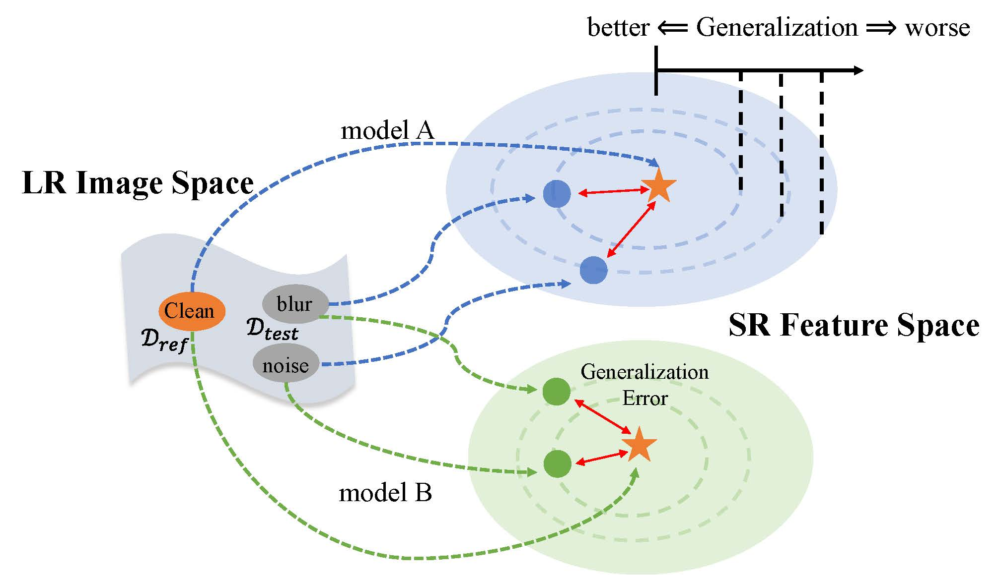

# SRGA [TPAMI2023]

## Evaluating the Generalization Ability of Super-Resolution Networks

This paper was accepted by IEEE Transactions on Pattern Analysis and Machine Intelligence (TPAMI). [[paper]](https://ieeexplore.ieee.org/abstract/document/10239439)


This is the first attempt to propose a Generalization Assessment Index for super-resolution and restoration networks, namely SRGA. SRGA exploits the statistical characteristics of the internal features of deep networks to measure the generalization ability.

## News
- [2024/5/31] :zap: We have released the codes! Please refer to the following instructions. (CPU version)

## Brief Introduction
SRGA is built upon the statistical modeling of deep features of SR networks. It is a relative measurement that computes the distance of the feature distributions between the reference dataset and the candidate test dataset. The reference dataset used in SRGA is typically the one on which the model performs well, and is usually within the training distribution.


- First obtain the corresponding deep features (the last layer) of the input datasets.
- These features are then compressed using principal component analysis (PCA).
- The resulting projected feature sets are modeled using a generalized Gaussian distribution (GGD).
- The generalization error is measured by the Kullback-Leibler divergence (KLD) between the two probability distributions, leading to the proposed generalization index SRGA.
- Smaller SRGA score means that the model has similar processing effects on different input degradations.



For a given model G, different input degradation types D1 and D2 will lead to different probability distributions. By quantifying the distance between these two resulting probability distributions, it is possible to measure the difference in the processing effect on different input distributions.


## Usage

### 1. Prepare the test datasets. 

In the paper, we collect a new fine-grained Patch-based Image Evaluation Set (PIES). It contains a variety of test images with different degradation types and degrees, including both synthetic and real-world degradations.

(i) Patch-based. Instead of evaluating a whole image with large resolution, we focus on image patches with
relatively small resolution (128 × 128 for HR and 32 × 32 for LR, i.e. × 4 SR). The degradation type and degree in one patch can be considered homogeneous and spatially invariant, which can facilitate analysis.

(ii) Fine-grained degradation types. PIES dataset contains different types of common degradation and covers a wide range of degradation degrees.

PIES dataset contains 41 subsets in total. Each subset contains 800 patches.

PIES dataset can be downloaded at [[Baidu Disk]]()

:zap: You can also collect your own test sets. We recommend you to crop the datasets into patches (eg., 32 $\times$ 32 input for $\times$ 4 SR; 128 $\times$ 128 input for restoration, etc.). The number of patches is recommended to be more 300. More patches can lead to better accuracy and lower variance.

### 2. Obtain the corresponding deep features.

Feed the model with the prepared datasets and save the corresponding features in npy format. For example, given [800, 3, 32, 32] input images (tensors), assume the model will output [800, 64, 128, 128] features. Flatten the features into shape [800, 64 $\times$ 128 $\times$ 128] ([800, 1048576]) and save it as a npy file. Repeat the above operations for all test sets.

### 3. Calculate the SRGA scores.

We provide an example code for calculating the SRGA scores in `example_calculate_SRGA_ref.py`. You can directly execute this file to get some senses.
```
python example_calculate_SRGA_ref.py
```

In this file, the features ([800, 1048576]) is randomly generated.

You can execute `calculate_SRGA_ref.py` with the actual saved features. You may modify the codes in terms of file paths, npy file names, or other miscellaneous.


## Citation

If you find our work is useful, please kindly cite it.

```BibTex
@ARTICLE{10239439,
  author={Liu, Yihao and Zhao, Hengyuan and Gu, Jinjin and Qiao, Yu and Dong, Chao},
  journal={IEEE Transactions on Pattern Analysis and Machine Intelligence}, 
  title={Evaluating the Generalization Ability of Super-Resolution Networks}, 
  year={2023},
  volume={45},
  number={12},
  pages={14497-14513},
  keywords={Degradation;Task analysis;Indexes;Superresolution;Image restoration;Predictive models;Data models;Model generalization ability;super-resolution networks},
  doi={10.1109/TPAMI.2023.3312313}}
```

```BibTex
@article{liu2021discovering,
  title={Discovering Distinctive" Semantics" in Super-Resolution Networks},
  author={Liu, Yihao and Liu, Anran and Gu, Jinjin and Zhang, Zhipeng and Wu, Wenhao and Qiao, Yu and Dong, Chao},
  journal={arXiv preprint arXiv:2108.00406},
  year={2021}
}
```